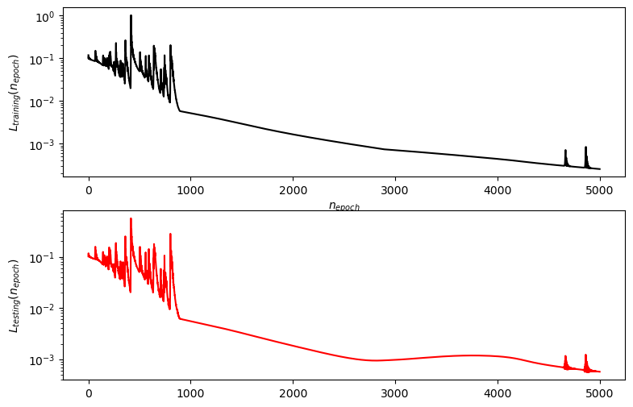
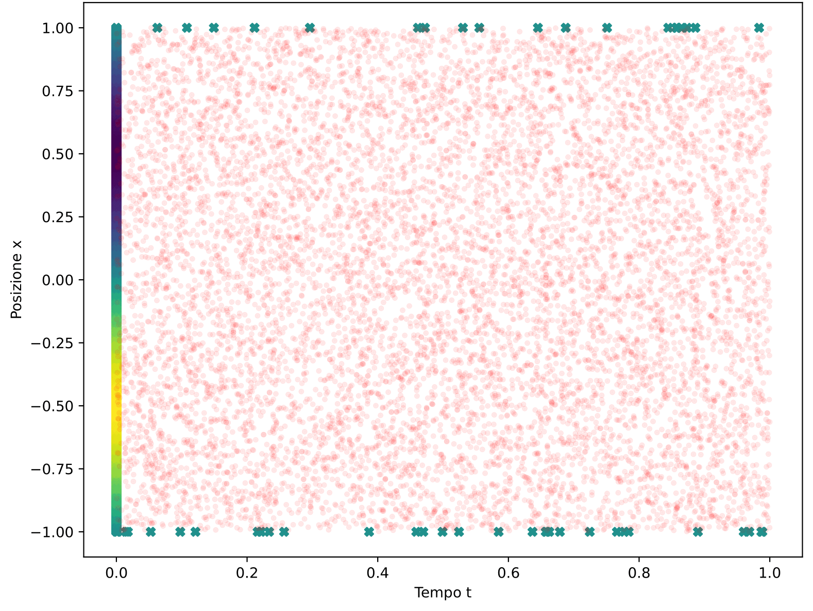
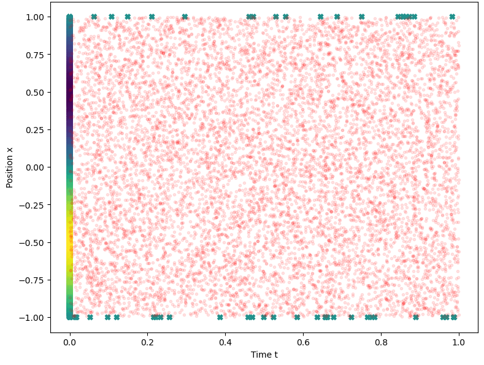
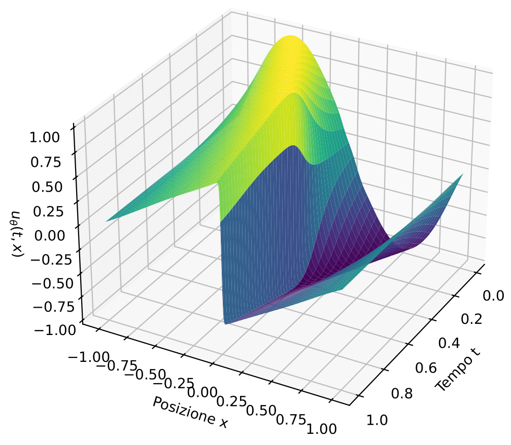

# pinn_solver_burgers_pde

A small physics-informed neural network (PINN) that solves the one-dimensional viscous Burgers equation.

This notebook was the final part of my compilative Bachelor's thesis. The thesis itself focuses on explaining how neural networks work in general, then how PINNs work in particular, and finally this small example that applies the method to the Burgers equation. It is meant simply as a demonstration of the approach.

The implementation follows closely the tutorial at
https://github.com/janblechschmidt/PDEsByNNs/blob/main/PINN_Solver.ipynb


## The problem

We solve the 1D viscous Burgers equation

```
u_t + u u_x = nu * u_xx
```

on the domain `t` in `[0, 1]`, `x` in `[-1, 1]`, with viscosity `nu = 0.01 / pi`.

Initial condition:

```
u(0, x) = -sin(pi * x)
```

Boundary conditions:

```
u(t, -1) = 0
u(t, +1) = 0
```

## PINN approach

A feedforward network `u_theta(t, x)` approximates the solution. It has 8 hidden layers with 20 neurons each and `tanh` activations. The inputs `(t, x)` are linearly rescaled to `[-1, 1]^2` before the first layer. A single linear output gives `u_theta`.

The PDE residual is

```
r(t, x) = u_t + u * u_x - nu * u_xx
```

In a nutshell, we make the neural network itself into an approximation of the solution of the differential equation; we do so by incorporating the PDE in the loss through the residuals. Therefore, training happens on randomly selected points in the spatiotemproal domain.

The loss is the unweighted sum of three mean squared terms:

```
L = mean(r^2) + mean((u_theta - u_0)^2) + mean((u_theta - u_b)^2)
```

where:

- the residual term is evaluated at `N_r = 10000` collocation points sampled uniformly in the domain,
- the initial condition term uses `N_0 = 5000` points at `t = 0`,
- the boundary condition term uses `N_b = 50` points on `x = -1` or `x = +1`.

The derivatives `u_t`, `u_x`, `u_xx` are computed with `tf.GradientTape`.

Training uses Adam with a piecewise constant learning rate schedule (`1e-2` for the first 1000 steps, `1e-3` up to 3000, then `5e-4`) for 5000 iterations. The initial weights are drawn from a Glorot normal distribution.

The "testing" loss uses fresh random points (1000 initial, 10 boundary, 2000 collocation) and is the same expression as the training loss. There is no comparison to a reference solution. 

## Results

Training loss and testing loss against the number of epochs (semilog y axis):



Sampled training points, colour coded by the initial value `u_0 = -sin(pi x)`:



Sampled testing points:



Predicted solution `u_theta(t, x)` on a `600 x 600` grid:



Total training time was about `15 min` on an Intel Core i5-5300 processor at 2.30 GHz with 8.00 GB RAM (no dedicated GPU).

An additional sanity check is computed at the end: the mean absolute residual `mean(|r|)` over `N_test = 50000` freshly sampled points in the domain.

Mean absolute residual over 50 000 points: `3.23 * 10^-4`

## Files

```
pinn_solver_burgers_pde/
    burgers_pinn_solver.ipynb        the notebook, everything is in here
    bs_thesis_full_italian.pdf       the full thesis this notebook was part of (IN ITALIAN)
    plots/
        epochs.png
        training_points_position.png
        test_points_position.png
        burgers_solution.png
```

## Notes and limitations

- This was a learning project. It is a direct application of the tutorial linked above, with minor changes for the plotting and the testing loss.
- Only one random seed is used. No seed study, no hyperparameter search, no ablation..
- The notebook is not packaged as a library and there is no environment file. 

## Declaration of AI use
The purpose of this project was to learn the basics of Neural networks (PINNs in particular) and of TensorFlow from scratch: no generative AI was used. 
